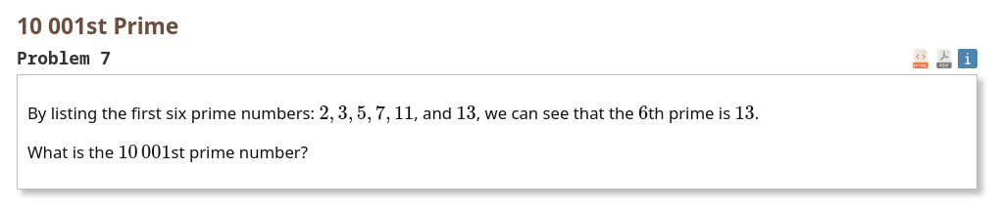
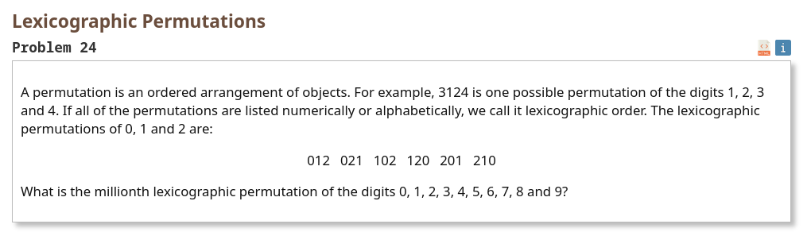

# Лабораторная работа 1
 - Выполнил: Думцев Виктор Сергеевич
 - Вариант: 7,24
 - Группа: P3312

## Задача 7

### Решение
Два варианта:
1. Решето Эратосфена
2. Сгенерировать список простых чисел, определяя простоту с помощью перебора делителей от 2 до корня из этого числа.

В своём решении я использовал оба варианта, в зависимости от удобства при выбранном варианте реализации(через рекурсию, либо через бесконечные структуры, и т.д.)

### Бесконечный список
```haskell
module Task7.Infinite (nthPrimeInf) where

sieve :: [Int] -> [Int]
sieve [] = []
sieve (p : xs) =
  p
    : sieve [x | x <- xs, x `mod` p /= 0]

primes :: [Int]
primes = sieve [2 ..]

nthPrimeInf :: Int -> Int
nthPrimeInf n = primes !! (n - 1)

```

### Map

Для данной задачи map бесполезен, так как условие для генерации простых чисел слишком сложное. Я могу конечно сделать вариант, где я делаю то же самое решение,что и в рекурсии, но только там будет map результат которого я не буду никуда сохранять, но это как будто не очень полезное действие.


### Модульное решение
```haskell
module Task7.Modular (nthPrimeMod) where

-- генерация
candidates :: [Int]
candidates = [2 ..]

-- фильтрация
sieve :: [Int] -> [Int]
sieve [] = []
sieve (p : xs) = p : sieve (filter (\x -> x `mod` p /= 0) xs)

-- получение результата
nthPrimeMod :: Int -> Int
nthPrimeMod n = sieve candidates !! (n - 1)

```

### Рекурсия(не хвостовая)
```haskell
module Task7.Recursive (nthPrimeRec) where

isPrime :: Int -> Bool
isPrime n
  | n <= 1 = False
  | otherwise = null [x | x <- [2 .. floor (sqrt (fromIntegral n :: Double))], n `mod` x == 0]

primesFrom :: Int -> [Int]
primesFrom k
  | isPrime k = k : primesFrom (k + 1)
  | otherwise = primesFrom (k + 1)

nthPrimeRec :: Int -> Int
nthPrimeRec n = primesFrom 2 !! (n - 1)

```

### Хвостовая рекурсия
```haskell
module Task7.TailRec (nthPrimeTail) where

isPrime :: Int -> Bool
isPrime n
  | n <= 1 = False
  | otherwise = null [x | x <- [2 .. floor (sqrt (fromIntegral n :: Double))], n `mod` x == 0]

nthPrimeTail :: Int -> Int
nthPrimeTail n = findPrime n 0 1
  where
    findPrime :: Int -> Int -> Int -> Int
    findPrime target count current
      | count == target = current - 1
      | isPrime current = findPrime target (count + 1) (current + 1)
      | otherwise = findPrime target count (current + 1)

```

## Задача 24


### Решение
Два варианта: 
1. Простой перебор - генерим много перестановок и выбираем нужную
2. Комбинаторный подход - если у нас есть n чисел, то мы можем выбрать конкретное число и количество перестановок с ним в роли ведущего числа будет равно (n-1)!. Тогда можно вычислить нужное число с помощью деления необходимого числа на это значение факториала(нам нужна целая часть). Остальные вычислить тем же образом, предварительно взяв остаток от деления на предыдущее число.

Тут я тоже оба использую, в зависимости от требований к реализации.

### Бесконечный список
Штош, тут он не бесконечный, но весьма большой, и мы не вычисляем его полностью.

```haskell
module Task24.Infinite (mainNthPermutationLazy) where

permutations :: Eq a => [a] -> [[a]]
permutations [] = [[]]
permutations xs = [x : ps | x <- xs, ps <- permutations (delete x xs)]
  where
    delete :: Eq a => a -> [a] -> [a]
    delete _ [] = []
    delete y (z : zs)
      | y == z = zs
      | otherwise = z : delete y zs

mainNthPermutationLazy :: Int -> String
mainNthPermutationLazy n = permutations "0123456789" !! (n - 1)

```

### Map
```haskell
module Task24.Map (nthPermutationMap) where

delete :: Eq a => a -> [a] -> [a]
delete _ [] = []
delete y (z : zs)
  | y == z = zs
  | otherwise = z : delete y zs

permutationsHeavyMap :: Eq a => [a] -> [[a]]
permutationsHeavyMap [] = [[]]
permutationsHeavyMap xs = concatMap generatePermutations xs
  where
    generatePermutations x = map (x :) (permutationsHeavyMap (delete x xs))

allPermsMap :: [[Char]]
allPermsMap = permutationsHeavyMap "0123456789"

nthPermutationMap :: Int -> String
nthPermutationMap n = allPermsMap !! (n - 1)

```

### Модульное решение
```haskell
module Task24.Modular (getNthPermutation) where

-- генерация
factorial :: Int -> Int
factorial 0 = 1
factorial n = product [1 .. n]

buildPermutationStep :: (Int, String, String) -> Int -> (Int, String, String)
buildPermutationStep (currentIdx, availableDigits, accumulator) n =
  let fact = factorial (n - 1)

      digitIdx = currentIdx `div` fact

      chosenDigit = availableDigits !! digitIdx

      nextavailableDigits = take digitIdx availableDigits ++ drop (digitIdx + 1) availableDigits

      nextIdx = currentIdx `mod` fact
   in (nextIdx, nextavailableDigits, accumulator ++ [chosenDigit])

-- свёртка
nthPermutationModular :: Int -> String
nthPermutationModular index =
  let lengths = [10, 9 .. 1]

      initialState = (index, "0123456789", "")

      (_, _, resultPermutation) = foldl' buildPermutationStep initialState lengths
   in resultPermutation

-- получение значения
getNthPermutation :: Int -> String
getNthPermutation n = nthPermutationModular (n - 1)

```

### Рекурсия(не хвостовая)
```haskell
module Task24.Recursive (mainNthPermutation) where

factorial :: Int -> Int
factorial 0 = 1
factorial n = n * factorial (n - 1)

nthPermutationNonTail :: Int -> String -> String
nthPermutationNonTail index digits = go index digits ""
  where
    go :: Int -> String -> String -> String
    go currentIdx available accumulator
      | null available = ""
      | currentIdx == 0 = available
      | otherwise =
          let n = length available
              fact = factorial (n - 1)

              digitIdx = currentIdx `div` fact

              chosenDigit = available !! digitIdx

              nextIdx = currentIdx `mod` fact

              nextAvailable = take digitIdx available ++ drop (digitIdx + 1) available
           in chosenDigit : go nextIdx nextAvailable accumulator

mainNthPermutation :: Int -> String
mainNthPermutation n = nthPermutationNonTail (n - 1) "0123456789"

```

### Хвостовая рекурсия
```haskell
module Task24.TailRec (mainNthPermutationTailRec) where

factorial :: Int -> Int
factorial 0 = 1
factorial n = n * factorial (n - 1)

nthPermutationTailRec :: Int -> String -> String
nthPermutationTailRec index digits = go index digits ""
  where
    go :: Int -> String -> String -> String
    go currentIdx available acc
      | null available = acc
      | currentIdx == 0 = acc ++ available
      | otherwise =
          let n = length available
              fact = factorial (fromIntegral n - 1)

              digitIdx = currentIdx `div` fact

              chosenDigit = available !! digitIdx

              nextIdx = currentIdx `mod` fact

              nextAvailable = take digitIdx available ++ drop (digitIdx + 1) available
           in go nextIdx nextAvailable (acc ++ [chosenDigit])

mainNthPermutationTailRec :: Int -> String
mainNthPermutationTailRec n = nthPermutationTailRec (n - 1) "0123456789"

```

## Выводы
Я изучил базовый синтаксис вроде получения элемента по индексу или отсечения головы списка, инструкции вроде take и drop, а также попробовал ленивую модель вычислений(это было непривычно). Больше всего мне понравились свёртки,filter и map.   